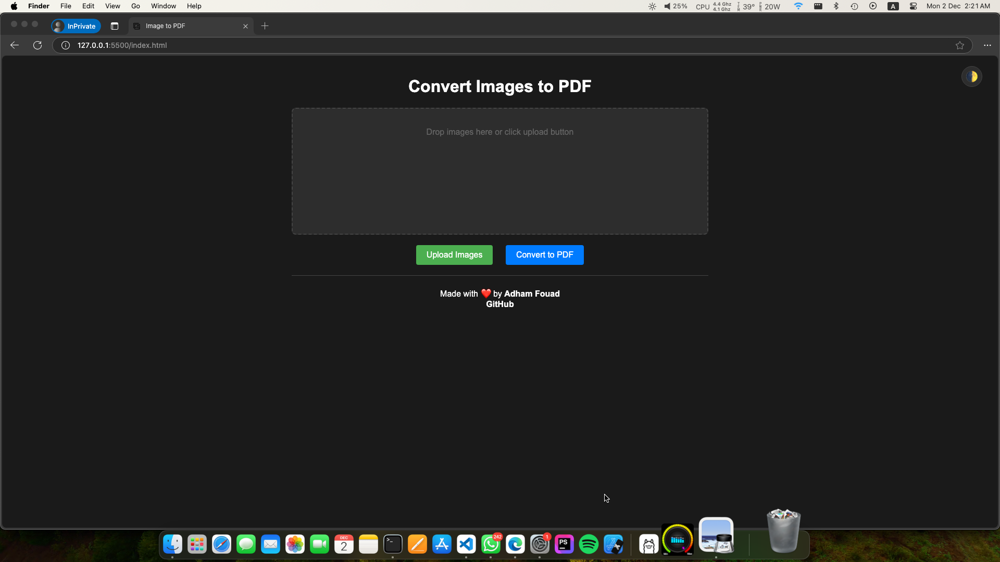

# Image to PDF Converter PWA

This web application allows users to convert images to PDF files. Users can upload multiple images, rearrange them, and convert them into a single PDF document.

## Features

- Drag and drop images or use the upload button
- Rearrange images by dragging
- Delete images before conversion
- Supports light and dark themes
- Converts images to a single PDF file
- Works entirely client-side
- Includes a service worker for offline functionality

## Screenshot

## How to Use

1. Open the web application.
2. Drag and drop images into the designated area or click the upload button to select images.
3. Rearrange the images by dragging them.
4. Click the "Convert to PDF" button to generate the PDF file.
5. Download the generated PDF file.

## Client-Side and Offline Functionality

This application works entirely on the client side, meaning no images or data are sent to a server. It also includes a service worker, allowing it to function as a Progressive Web App (PWA) and work offline.

## License

This project is licensed under the Attribution-NonCommercial-ShareAlike 4.0 International (CC BY-NC-SA 4.0) License. You are free to:

- Share: Copy and redistribute the material in any medium or format
- Adapt: Remix, transform, and build upon the material

Under the following terms:

- Attribution: You must give appropriate credit, provide a link to the license, and indicate if changes were made. You may do so in any reasonable manner, but not in any way that suggests the licensor endorses you or your use.
- NonCommercial: You may not use the material for commercial purposes.
- ShareAlike: If you remix, transform, or build upon the material, you must distribute your contributions under the same license as the original.

For more details, see the [license](LICENSE).